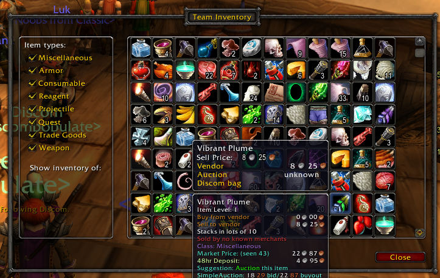

# TeamInventory
AddOn originally created by [Blubber](https://github.com/blubber) compatible with World of Warcraft Classic that shows the inventory of anyone in your party as long as they also have the addon.

# Features
- Display inventory of your party (if addon is installed)
- Trade items by clicking on them

# Installation
[Download](https://github.com/RobinKa/TeamInventory/archive/master.zip) the repository and extract the `TeamInventory-master` folder to your addon directory. Rename it to `TeamInventory` (without `-master`).

# Usage
`/ti show`: Shows the inventory